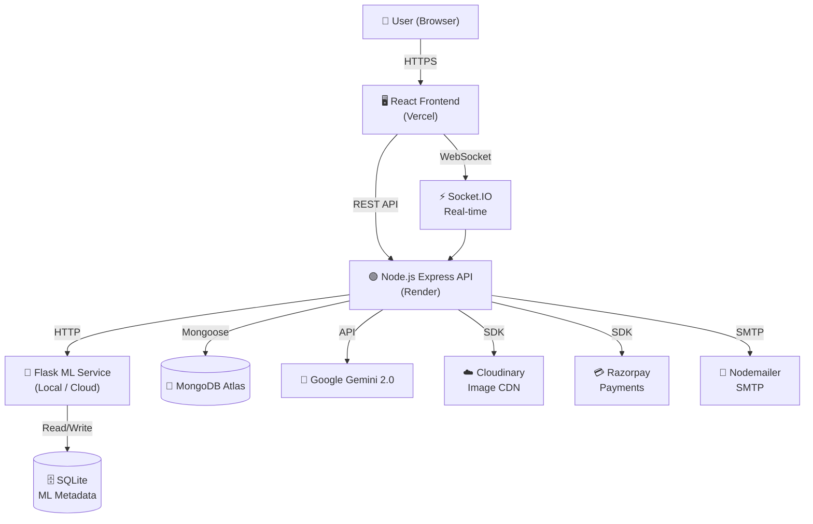

# 🌾 KisanBazaar — Project Report

> **A Direct Agricultural Marketplace & AI Advisory Ecosystem**
> *Bridging the gap between Indian farmers and buyers through technology.*

---

## 1. Project Overview

**KisanBazaar** is a next-generation, full-stack agricultural marketplace and AI advisory platform. It eliminates middlemen by creating a direct commerce channel between **farmers** and **buyers/wholesalers**, augmented by machine learning, real-time logistics, and multilingual AI assistance.

The platform empowers agricultural communities by providing:
- Transparent, fair-trade crop pricing based on live Mandi data
- AI-powered produce quality verification via computer vision
- A multilingual advisory chatbot (English, Kannada, Tulu, Hindi)
- End-to-end secure payments and live order tracking

| Item | Detail |
|---|---|
| **Project Name** | KisanBazaar |
| **License** | MIT |
| **Live Frontend** | [market-placee.vercel.app](https://market-placee-git-main-charannnaik24-8406s-projects.vercel.app/) |
| **Live API** | [market-placee.onrender.com](https://market-placee.onrender.com) |
| **GitHub** | [Charan-N-Naik/market_placee](https://github.com/Charan-N-Naik/market_placee) |

---

## 2. Technology Stack

| Layer | Technology |
|---|---|
| **Frontend** | React 18, Vite, TailwindCSS, React Router, Framer Motion, Recharts, Leaflet |
| **Node.js Backend** | Node.js, Express.js, Socket.IO, Mongoose, Razorpay, Cloudinary, Nodemailer |
| **Python ML Service** | Python, Flask, PyTorch, Scikit-Learn, Pillow, OpenCV, EXIF-read |
| **Primary Database** | MongoDB Atlas (via Mongoose) |
| **ML Metadata Store** | SQLite ([kisanbazaar.db](file:///e:/market_2.0/market_placee/backend/python/kisanbazaar.db)) |
| **AI Integration** | Google Gemini 2.0 API (`@google/genai`) |
| **Auth** | JWT (JSON Web Tokens), Email verification |
| **Media Storage** | Cloudinary (crop images) |
| **Payments** | Razorpay (with simulated fallback) |
| **Notifications** | Nodemailer (SMTP email), in-app notification system |
| **CI/CD** | GitHub Actions |
| **Hosting** | Vercel (Frontend), Render (Backend) |

---

## 3. System Architecture

```
market_placee/
├── frontend/                  # React 18 + Vite SPA
│   └── src/
│       ├── App.jsx            # Router + Context providers
│       ├── pages/             # 17 page-level components
│       ├── components/        # 23 reusable components
│       ├── context/           # Auth, Cart, Listing, Language contexts
│       ├── i18n/              # Multilingual translations (EN, KN, TU, HI)
│       ├── api/               # Axios API client modules
│       ├── services/          # Frontend service layer
│       ├── hooks/             # Custom React hooks
│       └── utils/             # Utility helpers
│
├── backend/
│   ├── node/                  # Express.js Core API Service
│   │   ├── server.js          # Entry point, Socket.IO setup
│   │   ├── models/            # 9 Mongoose schemas
│   │   ├── controllers/       # Business logic handlers
│   │   ├── routes/            # 14 RESTful route modules
│   │   ├── middleware/        # Auth guards, error handlers
│   │   ├── services/          # AgriChat, Razorpay, Cloudinary, Nodemailer
│   │   └── utils/             # Helpers
│   │
│   └── python/                # Flask ML Microservice
│       ├── app.py             # ML API endpoints (36KB)
│       ├── ml_model.py        # CV quality & disease classification
│       ├── train_model.py     # Model training pipeline
│       ├── prepare_dataset.py # Dataset preparation
│       └── verification/      # EXIF & image authenticity validation
│
└── server/
    └── check_db.js            # DB connectivity utility
```

### Architecture Flow



---

## 4. User Roles & Access Control

The platform supports **three distinct user roles**, each with dedicated dashboards and protected routes.

| Role | Dashboard Route | Access Level |
|---|---|---|
| **Farmer** | `/farmer/dashboard` | List crops, manage orders, AI quality check |
| **Buyer** | `/buyer/dashboard` | Browse listings, cart, checkout, order tracking |
| **Delivery Agent** | `/delivery/dashboard` | View & accept jobs, update transit status |

Role-based access is enforced via JWT middleware on the backend and `ProtectedRoute` guards on the frontend.

---

## 5. Application Pages

### 5.1 Public Pages
| Page | Route | Purpose |
|---|---|---|
| `LandingPage` | `/` | Hero, platform intro, role selection |
| `AuthPage` | `/login/:role`, `/register/:role` | Login & registration for all 3 roles |
| `ForgotPassword` | `/forgot-password` | Initiate password reset |
| `ResetPassword` | `/reset-password` | Complete password reset via token |
| `VerifyEmail` | `/verify-email/:token` | Email verification on signup |

### 5.2 Farmer Pages
| Page | Route | Purpose |
|---|---|---|
| `FarmerDashboard` | `/farmer/dashboard` | Crop inventory, yield analytics, order management, AI verification, payment history |

### 5.3 Buyer Pages
| Page | Route | Purpose |
|---|---|---|
| `BuyerDashboard` | `/buyer/dashboard` | Browse & filter crop listings, regional map, payment history |
| `ListingDetails` | `/listing/:id` | Full crop detail, buy modal, quality certificates |
| `CartPage` | `/cart` | Shopping cart management |
| `CheckoutPage` | `/checkout` | Address, delivery agent selection, Razorpay payment |
| `PendingOrdersPage` | `/buyer/pending-orders` | Order lifecycle tracker with visual status stepper |
| `StateCropsPage` | `/state/:stateName` | Region-specific crop catalog |

### 5.4 Delivery Agent Pages
| Page | Route | Purpose |
|---|---|---|
| `DeliveryAgentDashboard` | `/delivery/dashboard` | Vehicle profile, job listing, transit status updates (Packed → Collected → Shipped → Delivered) |

### 5.5 Shared Authenticated Pages
| Page | Route | Purpose |
|---|---|---|
| `IntelligenceHub` | `/intelligence` | Hub for all AI-powered tools |
| `AIChatbot` | `/chat` | Multilingual AgriChat assistant |
| `WeatherPage` | `/weather` | Weather data for farming decisions |
| `MarketPricePage` | `/market-prices` | Live Mandi/market price analytics |
| `GovernmentSchemesPage` | `/schemes` | Agricultural scheme lookup (PM-KISAN, etc.) |

---

## 6. Backend API Routes (Node.js)

| Route File | Prefix | Purpose |
|---|---|---|
| [authRoutes.js](file:///e:/market_2.0/market_placee/backend/node/routes/authRoutes.js) | `/api/auth` | Register, login, email verify, password reset |
| [listingRoutes.js](file:///e:/market_2.0/market_placee/backend/node/routes/listingRoutes.js) | `/api/listings` | CRUD for crop listings |
| [orderRoutes.js](file:///e:/market_2.0/market_placee/backend/node/routes/orderRoutes.js) | `/api/orders` | Order placement, status transitions, lifecycle |
| [paymentRoutes.js](file:///e:/market_2.0/market_placee/backend/node/routes/paymentRoutes.js) | `/api/payments` | Razorpay order creation & verification |
| [cartRoutes.js](file:///e:/market_2.0/market_placee/backend/node/routes/cartRoutes.js) | `/api/cart` | Cart management |
| [agriChatRoutes.js](file:///e:/market_2.0/market_placee/backend/node/routes/agriChatRoutes.js) | `/api/agrichat` | AgriChat AI session endpoints |
| [chatRoutes.js](file:///e:/market_2.0/market_placee/backend/node/routes/chatRoutes.js) | `/api/chat` | Direct buyer-farmer messaging |
| [cropVerificationRoutes.js](file:///e:/market_2.0/market_placee/backend/node/routes/cropVerificationRoutes.js) | `/api/verify-crop` | Trigger ML crop quality verification |
| [productVerificationRoutes.js](file:///e:/market_2.0/market_placee/backend/node/routes/productVerificationRoutes.js) | `/api/product-verify` | EXIF/image authenticity check |
| [verificationRoutes.js](file:///e:/market_2.0/market_placee/backend/node/routes/verificationRoutes.js) | `/api/verification` | General verification status |
| [marketRoutes.js](file:///e:/market_2.0/market_placee/backend/node/routes/marketRoutes.js) | `/api/market` | Market price data |
| [schemeRoutes.js](file:///e:/market_2.0/market_placee/backend/node/routes/schemeRoutes.js) | `/api/schemes` | Government scheme lookup |
| [notificationRoutes.js](file:///e:/market_2.0/market_placee/backend/node/routes/notificationRoutes.js) | `/api/notifications` | In-app notification CRUD |
| [assistantRoutes.js](file:///e:/market_2.0/market_placee/backend/node/routes/assistantRoutes.js) | `/api/assistant` | Gemini AI assistant calls |

---

## 7. Database Models (MongoDB / Mongoose)

| Model | File | Key Fields |
|---|---|---|
| **User** | [User.js](file:///e:/market_2.0/market_placee/backend/node/models/User.js) | name, email, password (hashed), role (farmer/buyer/delivery_agent), isVerified, isApproved |
| **Listing** | [Listing.js](file:///e:/market_2.0/market_placee/backend/node/models/Listing.js) | cropName, grade, price, quantity, location, harvestDate, images, verificationStatus, farmer ref |
| **Order** | [Order.js](file:///e:/market_2.0/market_placee/backend/node/models/Order.js) | buyer ref, farmer ref, deliveryAgent ref, items, status, paymentStatus, timeline |
| **Payment** | [Payment.js](file:///e:/market_2.0/market_placee/backend/node/models/Payment.js) | order ref, razorpayOrderId, amount, currency, status |
| **Cart** | [Cart.js](file:///e:/market_2.0/market_placee/backend/node/models/Cart.js) | user ref, items[], quantities |
| **Notification** | [Notification.js](file:///e:/market_2.0/market_placee/backend/node/models/Notification.js) | recipient, message, type, isRead, createdAt |
| **Chat** | [Chat.js](file:///e:/market_2.0/market_placee/backend/node/models/Chat.js) | participants, messages[], timestamps |
| **GovernmentScheme** | [GovernmentScheme.js](file:///e:/market_2.0/market_placee/backend/node/models/GovernmentScheme.js) | name, description, eligibility, benefits, applicationUrl |
| **PesticideAdvisory** | [PesticideAdvisory.js](file:///e:/market_2.0/market_placee/backend/node/models/PesticideAdvisory.js) | crop, disease, recommendedPesticide, safetyInstructions |

---

## 8. Key Features Deep Dive

### 8.1 🤖 AI Crop Quality Verification (Computer Vision)
- Farmers upload crop images via [AICropAnalyzer.jsx](file:///e:/market_2.0/market_placee/frontend/src/components/AICropAnalyzer.jsx)
- Images are sent to the **Flask ML microservice** ([app.py](file:///e:/market_2.0/market_placee/backend/python/app.py))
- [ml_model.py](file:///e:/market_2.0/market_placee/backend/python/ml_model.py) runs a **PyTorch / Scikit-Learn** pipeline for quality grading and disease classification
- The `verification/` folder runs **EXIF geolocation** checks to validate image authenticity
- Results return a quality grade + a downloadable **Verification Certificate** displayed in [VerificationReport.jsx](file:///e:/market_2.0/market_placee/frontend/src/components/VerificationReport.jsx)

### 8.2 🗣️ AgriChat — Multilingual AI Advisory
- Powered by **Google Gemini 2.0 API**
- Floating chat widget (`AgriChatWidget`) available on every page
- Full chat page at `/chat` and `/intelligence`
- Supports **English, Kannada, Tulu, Hindi** via `i18n/` translation layer
- Features **voice input** (Web Speech API) and **speech synthesis** for accessibility
- Provides guidance on: crop diseases, pesticide recommendations, government schemes, weather advisories

### 8.3 💳 Order & Payment Lifecycle
1. **Buyer** adds to cart → proceeds to checkout
2. `CheckoutPage` calls Razorpay via `/api/payments` to create an order
3. Payment confirmed → Order status: `paid`
4. **Farmer** is notified → marks order as `packed`
5. **Delivery Agent** accepts job → collects → ships → delivers
6. **Buyer** confirms receipt → order `delivered`
7. Full status stepper visible in `PendingOrdersPage`

### 8.4 🚚 Delivery Agent Ecosystem
- Agents register/login with `delivery_agent` role
- `DeliveryAgentDashboard` shows available jobs filtered by Karnataka districts (31 regions)
- [DeliveryLogisticsSection.jsx](file:///e:/market_2.0/market_placee/frontend/src/components/DeliveryLogisticsSection.jsx) (49KB) handles: vehicle profile, distance/transport cost calculator, booking modal with farmer sourcing form
- [LiveDeliveryTracker.jsx](file:///e:/market_2.0/market_placee/frontend/src/components/LiveDeliveryTracker.jsx) provides real-time tracking via **Socket.IO**

### 8.5 🗺️ Regional Crop Mapping
- [IndiaCropMap.jsx](file:///e:/market_2.0/market_placee/frontend/src/components/IndiaCropMap.jsx) — Interactive Leaflet map of crop supply clusters across India
- [MapComponent.jsx](file:///e:/market_2.0/market_placee/frontend/src/components/MapComponent.jsx) — Detailed regional map component
- `/state/:stateName` routes to `StateCropsPage` — region-specific crop catalog

### 8.6 📊 Market Intelligence
- `MarketPricePage` — Live Mandi (wholesale market) rates by district/crop
- [MarketTrends.jsx](file:///e:/market_2.0/market_placee/frontend/src/components/MarketTrends.jsx) — Recharts-powered price trend visualizations
- Helps farmers price produce fairly; helps buyers source competitively

### 8.7 🌤️ Weather Integration
- `WeatherPage` and [WeatherWidget.jsx](file:///e:/market_2.0/market_placee/frontend/src/components/WeatherWidget.jsx) — Location-aware weather data
- Integrated into farming decisions (planting/harvesting timing)

### 8.8 📬 Notification System
- In-app notification inbox ([GmailNotificationInbox.jsx](file:///e:/market_2.0/market_placee/frontend/src/components/GmailNotificationInbox.jsx)) — styled like Gmail
- Email notifications via **Nodemailer** for order events (paid, packed, shipped, delivered)
- [Notification.js](file:///e:/market_2.0/market_placee/backend/node/models/Notification.js) model tracks read/unread state per user

---

## 9. Frontend Architecture Details

### Context State Management
| Context | Purpose |
|---|---|
| `AuthContext` | JWT token, user profile, login/logout |
| `CartContext` | Cart items, quantities, totals |
| `ListingContext` | Shared crop listing state |
| Language Context | Active language (EN/KN/TU/HI) |

### Theme System
[App.jsx](file:///e:/market_2.0/market_placee/frontend/src/App.jsx) applies dynamic CSS themes per route:
- 🌱 `/farmer/*` → `theme-farmer` (green palette)
- 🛒 `/buyer/*`, `/cart`, `/checkout` → `theme-buyer` (amber/blue palette)
- 🤖 `/intelligence`, `/chat` → `theme-ai` (dark futuristic palette)

### Key Reusable Components
| Component | Purpose |
|---|---|
| [CropCard.jsx](file:///e:/market_2.0/market_placee/frontend/src/components/CropCard.jsx) | Crop listing card with grade badge |
| [AICropAnalyzer.jsx](file:///e:/market_2.0/market_placee/frontend/src/components/AICropAnalyzer.jsx) | Full crop image upload & analysis UI |
| [PaymentModal.jsx](file:///e:/market_2.0/market_placee/frontend/src/components/PaymentModal.jsx) | Razorpay payment modal |
| [LiveDeliveryTracker.jsx](file:///e:/market_2.0/market_placee/frontend/src/components/LiveDeliveryTracker.jsx) | Real-time Socket.IO order tracker |
| [VerificationReport.jsx](file:///e:/market_2.0/market_placee/frontend/src/components/VerificationReport.jsx) | Quality certificate viewer |
| [DeliveryLogisticsSection.jsx](file:///e:/market_2.0/market_placee/frontend/src/components/DeliveryLogisticsSection.jsx) | Transport cost calculator & booking |
| [DirectBuyerChatModal.jsx](file:///e:/market_2.0/market_placee/frontend/src/components/DirectBuyerChatModal.jsx) | Real-time buyer-farmer direct messaging |

---

## 10. Python ML Microservice

| File | Purpose |
|---|---|
| [app.py](file:///e:/market_2.0/market_placee/backend/python/app.py) | Flask REST API — 36KB, exposes all ML endpoints |
| [ml_model.py](file:///e:/market_2.0/market_placee/backend/python/ml_model.py) | Core CV model — crop quality grade + disease detection |
| [train_model.py](file:///e:/market_2.0/market_placee/backend/python/train_model.py) | Training pipeline — PyTorch/Sklearn model training |
| [prepare_dataset.py](file:///e:/market_2.0/market_placee/backend/python/prepare_dataset.py) | Dataset preprocessing & augmentation |
| [kisanbazaar_intent_model.pkl](file:///e:/market_2.0/market_placee/backend/python/kisanbazaar_intent_model.pkl) | Trained intent classification model (57KB) |
| [kisanbazaar_dataset.pkl](file:///e:/market_2.0/market_placee/backend/python/kisanbazaar_dataset.pkl) | Dataset pickle for ML inference |
| [kisanbazaar.db](file:///e:/market_2.0/market_placee/backend/python/kisanbazaar.db) | SQLite — ML metadata, local caching |
| `verification/` | EXIF geolocation & image authenticity validator |

---

## 11. CI/CD Pipeline (GitHub Actions)

The pipeline runs on every **push to `main`** and executes 3 parallel jobs:

```
Push to main
      │
      ├──────────────────────────────────────┐────────────────────────────┐
      ▼                                      ▼                            ▼
🖥️ Frontend CI                    🟢 Node.js Backend CI          🐍 Python ML CI
(npm install → ESLint → Vite build) (npm install → syntax check)  (pip install → syntax check)
      │                                      │                            │
      └──────────────────────────────────────┴────────────────────────────┘
                                             │
                                             ▼
                                  ✅ All Checks Passed
```

**Branch Protection:** `main` is protected — direct pushes blocked, minimum 1 admin approval required for all PRs.

---

## 12. Deployment

| Service | Platform | URL |
|---|---|---|
| Frontend | **Vercel** | [market-placee.vercel.app](https://market-placee-git-main-charannnaik24-8406s-projects.vercel.app/) |
| Node.js API | **Render** (Free Tier) | [market-placee.onrender.com](https://market-placee.onrender.com) |
| Database | **MongoDB Atlas** | `cluster0.kybkp5w.mongodb.net` |
| Python ML | Self-hosted / Local | `http://localhost:5001` |

> ⚠️ The Render backend (free tier) has a **30–60 second cold start** after inactivity.

---

## 13. Environment Variables Required

```env
# backend/node/.env
PORT=5000
MONGO_URI=mongodb+srv://...
JWT_SECRET=your_jwt_secret_key
GEMINI_API_KEY=your_google_gemini_api_key
CLOUDINARY_CLOUD_NAME=your_cloudinary_name
CLOUDINARY_API_KEY=your_cloudinary_key
CLOUDINARY_API_SECRET=your_cloudinary_secret
RAZORPAY_KEY_ID=your_razorpay_key
RAZORPAY_KEY_SECRET=your_razorpay_secret
```

---

## 14. Summary

**KisanBazaar** is a production-ready, full-stack agricultural platform with:

- ✅ **3-tier architecture**: React SPA ↔ Node.js API ↔ Python ML microservice
- ✅ **3 user roles**: Farmer, Buyer, Delivery Agent — each with dedicated dashboards
- ✅ **Complete order lifecycle**: Cart → Payment → Packing → Collection → Delivery
- ✅ **AI-powered**: Gemini 2.0 advisory chatbot + PyTorch computer vision crop grader
- ✅ **Multilingual**: English, Kannada, Tulu, Hindi
- ✅ **Real-time**: Socket.IO for live order tracking and delivery updates
- ✅ **Secure**: JWT auth, Razorpay escrow payments, Cloudinary media, EXIF verification
- ✅ **CI/CD**: GitHub Actions pipeline with branch protection

---
*Report generated on 2026-09-27 | KisanBazaar v2.0*
